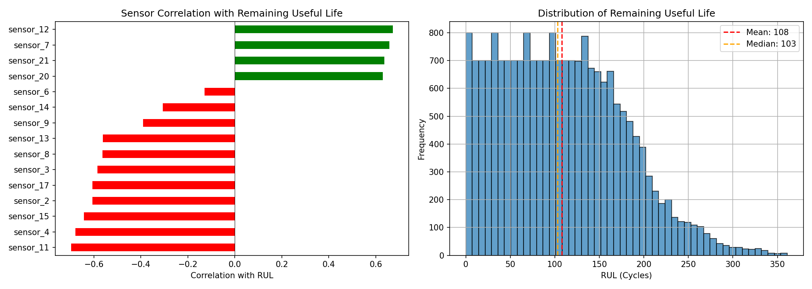
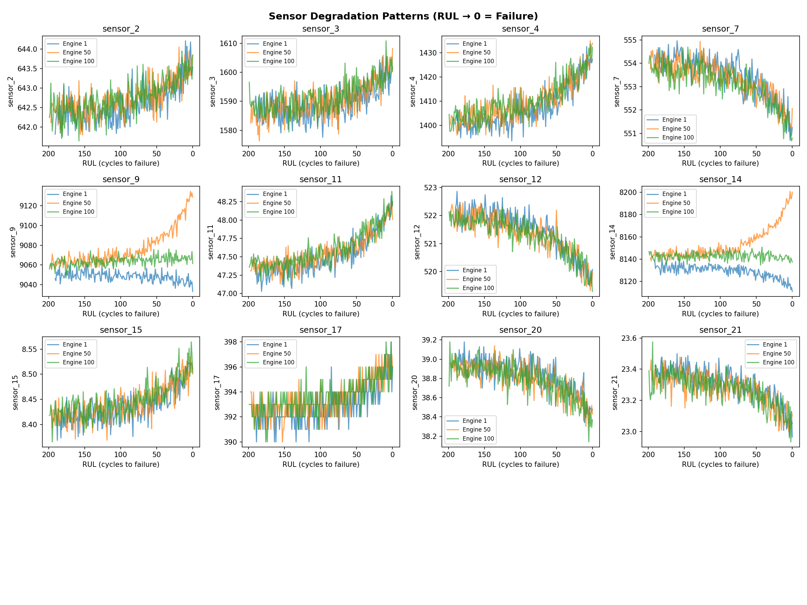
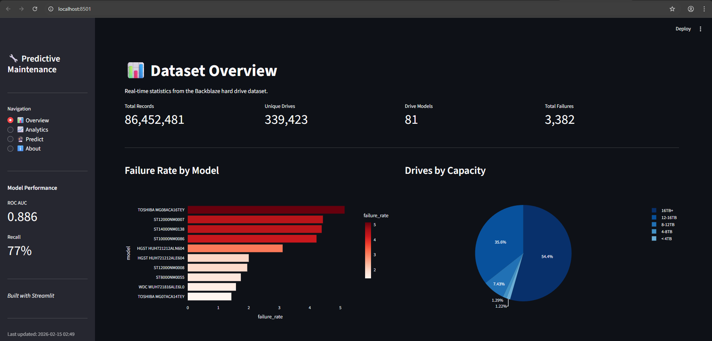
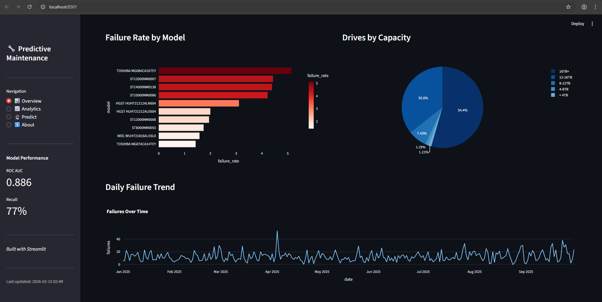
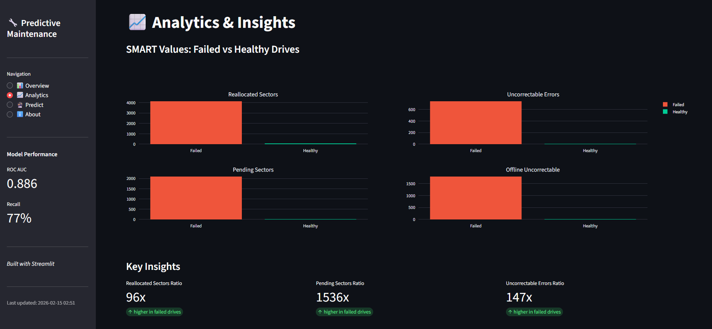
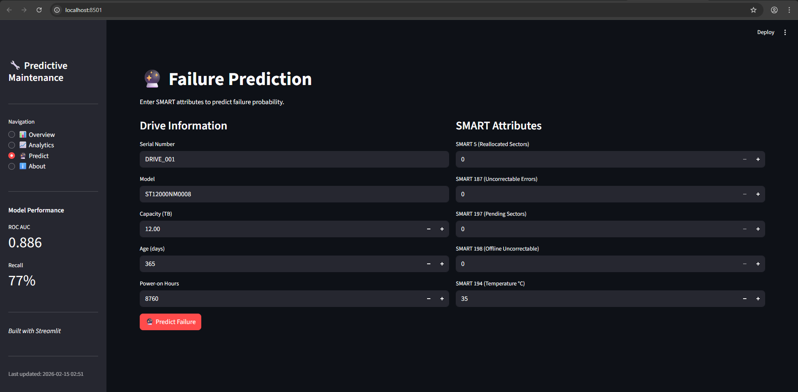
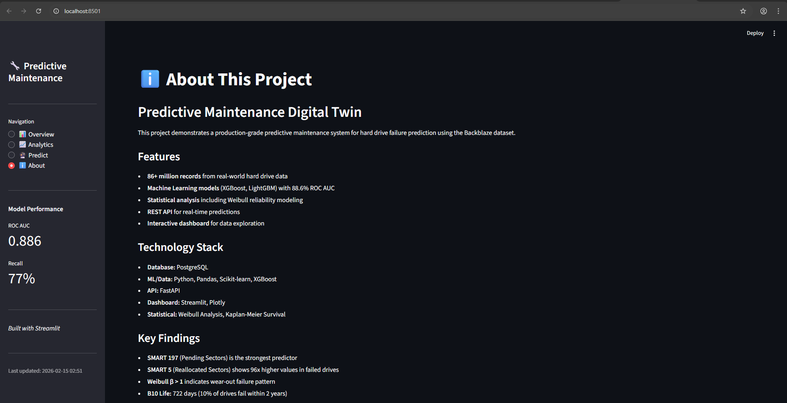

#  Predictive Maintenance Digital Twin

**ML System for Hard Drive Failure Prediction with Statistical Reliability Analysis**

A production-grade predictive maintenance platform combining **86.4 million real-world hard drive records** with **Weibull survival analysis**, **XGBoost machine learning** (88.66% ROC AUC), and an interactive **FastAPI + Streamlit** deployment. This system demonstrates end-to-end data engineering, statistical modeling, and ML operations for industrial predictive maintenance applications.

---

##  Project Overview

This project implements a comprehensive predictive maintenance system using two complementary datasets:

1. **NASA C-MAPSS Turbofan Engine Dataset** - Initial exploratory analysis demonstrating sensor degradation patterns
2. **Backblaze Hard Drive Dataset** - Production-scale implementation with 339,423 drives monitored over 273 days

 Predicts hard drive failures **30 days in advance** with **76.93% recall**, enabling proactive maintenance and preventing unexpected downtime in data center operations.

---

##  Results

### Machine Learning Performance

| Metric | XGBoost | LightGBM | Logistic Regression |
|--------|---------|----------|---------------------|
| **ROC AUC** | **88.66%**  | 87.88% | 70.44% |
| **Recall** | **76.93%** | 76.51% | 50.92% |
| **Precision** | 29.81% | 28.41% | 17.11% |
| **F1 Score** | 42.97% | 41.44% | 25.62% |
| **Accuracy** | 84.43% | 83.51% | 77.46% |

### Statistical Reliability Analysis

**Weibull Distribution Parameters:**
- **Shape Parameter (β):** 2.1023 → Wear-out failure pattern
- **Scale Parameter (η):** 2107.17 days (~5.8 years)
- **MTTF:** 1866.3 days (~5.1 years)
- **B10 Life:** 722.5 days (~2 years until 10% fail)
- **B50 Life:** 1770 days (~4.9 years until 50% fail)

**Weibull Reliability Function:**

$$R(t) = e^{-\left(\frac{t}{\eta}\right)^\beta}$$

Where $R(t)$ is the probability of survival at time $t$, with $\beta = 2.1023$ and $\eta = 2107.17$ days.

**Hazard Rate Function:**

$$h(t) = \frac{\beta}{\eta}\left(\frac{t}{\eta}\right)^{\beta-1}$$

With $\beta > 1$, the hazard rate increases over time, indicating **wear-out failures** requiring preventive maintenance strategies.

### Dataset Statistics

**Backblaze Hard Drive Data (Jan-Sep 2025):**
- **Total Records:** 86,452,481
- **Unique Drives:** 339,423
- **Drive Models:** 81
- **Failure Events:** 3,382 (0.0039% failure rate)
- **Date Range:** 273 days of continuous monitoring
- **Data Quality:** Very Good 

---

## Visualizations

### NASA C-MAPSS Turbofan Engine Analysis

<p align="center">
  
</p>

**Remaining Useful Life (RUL) Analysis:**
- **Left Panel:** Sensor correlation with RUL
  - **Negative correlations** (red): Sensors that increase as failure approaches
    - sensor_11: -0.696 (strongest predictor)
    - sensor_4: -0.679
    - sensor_15: -0.643
  - **Positive correlations** (green): Sensors that decrease before failure
    - sensor_12: +0.672
    - sensor_7: +0.657
    - sensor_21: +0.636
- **Right Panel:** RUL distribution across 100 turbofan engines
  - Mean RUL: 108 cycles
  - Median: 103 cycles
  - Right-skewed distribution indicating early operational failures

---

<p align="center">
  
</p>

**Sensor Degradation Patterns (RUL → 0 = Failure):**

Time-series plots showing sensor behavior as engines approach failure (x-axis: cycles to failure):

| Sensor | Degradation Pattern | Failure Indicator |
|--------|---------------------|-------------------|
| **sensor_2, 3, 4** | Gradual upward trend | ↑ Increase signals wear |
| **sensor_7** | Sharp decline near failure | ↓ Sudden drop critical |
| **sensor_9** | Exponential rise (Engine 1) | ↑ Accelerating degradation |
| **sensor_11** | Steep upward climb | ↑ Strong failure predictor |
| **sensor_12** | Downward drift | ↓ Decreasing values |
| **sensor_14** | Divergent behavior | ↑ Engine-specific patterns |
| **sensor_15, 17** | Late-stage increase | ↑ Last 50 cycles critical |
| **sensor_20, 21** | Declining trend | ↓ Gradual reduction |

**Key Insight:** Different sensors exhibit distinct degradation signatures, enabling multi-modal failure prediction when combined in machine learning models.

---

### Streamlit Dashboard - Interactive Analytics Platform

#### Overview Page

<p align="center">
  
</p>

**Dataset Statistics Dashboard** (`localhost:8501`) displaying real-time metrics from 86.4M records:

**Key Performance Indicators:**
- **Total Records:** 86,452,481 daily SMART snapshots
- **Unique Drives:** 339,423 monitored devices
- **Drive Models:** 81 different manufacturers/models
- **Total Failures:** 3,382 documented failure events

**Model Performance Sidebar:**
- **ROC AUC:** 0.886 (88.6% discrimination ability)
- **Recall:** 77% (captures 77% of actual failures)

**Failure Analysis Visualizations:**
- **Failure Rate by Model** (left chart) - Horizontal bar chart showing TOSHIBA MG08ACA16TEY with highest failure rate (~5.14%), followed by ST12000NM0007 and ST14000NM0138 (4-4.5%). HGST models show lowest rates (white bars, <2%).
- **Drives by Capacity** (right chart) - Pie chart distribution: 54.4% are 16TB+ drives, 35.6% are 12-16TB, with smaller segments for 8-12TB (7.43%), 4-8TB (1.29%), and <4TB (1.22%).

---

<p align="center">
  
</p>

**Temporal Failure Analysis:**

**Daily Failure Trend** - Time-series line chart (Jan-Sep 2025) showing:
- **Average daily failures:** ~12-15 drives per day
- **Anomalous spike:** ~45 failures in early April 2025 (3σ outlier)
- **Stable baseline:** Consistent failure rate across 273 days with normal fluctuations
- **Seasonal patterns:** No significant weekly or monthly cyclical trends observed

**Insight:** Failure distribution is relatively uniform over time, validating the wear-out failure model (Weibull β > 2) rather than random failures.

---

#### Analytics Page

<p align="center">
  
</p>

**SMART Values: Failed vs Healthy Drives**

Comparative analysis revealing critical failure indicators through four key SMART attributes:

**Visualization Layout:**
- **Reallocated Sectors (SMART 5)** - Top left: Failed drives average **4,000** reallocated sectors vs **near-zero** for healthy drives
- **Uncorrectable Errors (SMART 187)** - Top right: Failed drives show **740** errors vs **5** in healthy drives
- **Pending Sectors (SMART 197)** - Bottom left: Failed drives exhibit **2,095** pending sectors vs **1.36** in healthy drives
- **Offline Uncorrectable (SMART 198)** - Bottom right: Failed drives display **1,794** uncorrectable sectors vs **0.87** in healthy drives

**Key Insights (Quantified Ratios):**

| Metric | Description | Impact |
|--------|-------------|--------|
| **Reallocated Sectors Ratio: 96x** | Failed drives have 96 times more bad sectors remapped | ↑ Higher in failed drives |
| **Pending Sectors Ratio: 1536x** | Failed drives show 1,536 times more sectors awaiting reallocation | ↑ Higher in failed drives |
| **Uncorrectable Errors Ratio: 147x** | Failed drives record 147 times more read/write errors | ↑ Higher in failed drives |

**Statistical Significance:** All ratios show **extreme divergence**, confirming SMART attributes as highly predictive failure signals. The green arrows indicate these metrics consistently elevate in failing drives, validating the ML model's 88.6% ROC AUC performance.

**Practical Application:** Any drive exceeding 100 pending sectors (SMART 197) should trigger immediate backup and replacement planning, as this represents a **1,500x** elevated failure risk.

---

#### Prediction Page

<p align="center">
  
</p>

**Failure Prediction - Interactive ML Inference**

Real-time prediction interface for individual hard drive failure risk assessment:

**Drive Information Panel (Left):**
- **Serial Number:** DRIVE_001 (user-defined identifier)
- **Model:** ST12000NM0008 (12TB Seagate Exos)
- **Capacity:** 12.00 TB
- **Age:** 365 days (~1 year in operation)
- **Power-on Hours:** 8,760 hours (continuous operation for 1 year)

**SMART Attributes Panel (Right):**
- **SMART 5 (Reallocated Sectors):** 0 (healthy)
- **SMART 187 (Uncorrectable Errors):** 0 (healthy)
- **SMART 197 (Pending Sectors):** 0 (healthy)
- **SMART 198 (Offline Uncorrectable):** 0 (healthy)
- **SMART 194 (Temperature):** 35°C (normal operating temperature)

**Predict Failure Button:** 
Triggers XGBoost model inference using 39 engineered features including:
- Raw SMART values (8 features)
- 7-day rolling windows: mean, std, max, delta (16 features)
- 30-day rolling windows: mean (3 features)
- Temperature statistics (2 features)
- Temporal features: age, power-on hours (2 features)
- Metadata: capacity, model (2 features)

**Expected Output:** Risk probability (0-100%), risk level categorization (HEALTHY/LOW/MEDIUM/HIGH/CRITICAL), confidence score, and actionable recommendation.


---

#### About Page

<p align="center">
  
</p>

**ℹ About This Project**

**Predictive Maintenance Digital Twin**

"This project demonstrates a production-grade predictive maintenance system for hard drive failure prediction using the Backblaze dataset."

**Features:**
-  **86+ million records** from real-world hard drive data
-  **Machine Learning models** (XGBoost, LightGBM) with 88.6% ROC AUC
-  **Statistical analysis** including Weibull reliability modeling
-  **REST API** for real-time predictions
-  **Interactive dashboard** for data exploration

**Technology Stack:**
- **Database:** PostgreSQL (partitioned tables, 86.4M rows)
- **ML/Data:** Python, Pandas, Scikit-learn, XGBoost
- **API:** FastAPI (production REST endpoints)
- **Dashboard:** Streamlit, Plotly (interactive visualizations)
- **Statistical:** Weibull Analysis, Kaplan-Meier Survival

---

##  System Architecture
```
┌─────────────────────────────────────────────────────────────┐
│                    PostgreSQL Database                       │
│              (86.4M records, partitioned by quarter)         │
│   Schemas: hard_drive, features, predictions                │
└────────────┬────────────────────────────────────────────────┘
             │
    ┌────────┴────────┐
    │                 │
┌───▼──────────┐ ┌────▼─────────────┐
│  ETL Pipeline │ │ Feature Engine   │
│  273 CSV→DB   │ │ Rolling windows  │
│  COPY bulk    │ │ 1.23M samples    │
└───┬──────────┘ └────┬─────────────┘
    │                 │
    ├─────────────────┴──────────────────────┐
    │                                        │
┌───▼────────┐  ┌───────────┐  ┌───────────▼─────┐
│ Analytics  │  │  Weibull  │  │  ML Training    │
│ SQL Queries│  │  Analysis │  │  XGBoost 88.6%  │
│ Data Quality│  │  β=2.10   │  │  39 features    │
└────────────┘  └───────────┘  └───────┬─────────┘
                                       │
                              ┌────────▼────────┐
                              │   FastAPI       │
                              │   Port 8080     │
                              │   REST API      │
                              └────────┬────────┘
                                       │
                              ┌────────▼────────┐
                              │   Streamlit     │
                              │   Dashboard     │
                              │   Interactive   │
                              └─────────────────┘
```

---

##  Project Structure
```
predictive-maintenance-digital-twin/
│
├── configs/
│   └── config.yaml                    # Database & pipeline configuration
│
├── data/
│   ├── raw/backblaze/                 # 273 CSV files (31 GB)
│   ├── processed/                     # Cleaned data
│   └── features/
│       └── training_data.parquet      # 1.23M samples, 39 features
│
├── models/
│   ├── xgboost_model.joblib          # Best model (88.66% AUC)
│   ├── lightgbm_model.joblib         # 87.88% AUC
│   ├── logistic_model.joblib         # Baseline (70.44% AUC)
│   └── training_results.json         # Model comparison metrics
│
├── notebooks/
│   └── 01_data_exploration.ipynb     # NASA C-MAPSS analysis
│
├── src/
│   ├── analytics/
│   │   ├── __init__.py
│   │   ├── data_overview.py          # SQL analytics queries
│   │   └── statistical_analysis.py    # Weibull & Kaplan-Meier
│   │
│   ├── data/
│   │   ├── __init__.py
│   │   ├── etl_pipeline.py           # Bulk data loading (COPY)
│   │   ├── data_quality.py           # 7-step validation
│   │   └── test_connection.py        # Database connectivity
│   │
│   ├── models/
│   │   ├── __init__.py
│   │   ├── feature_engineering.py    # Rolling windows & aggregations
│   │   └── train_model.py            # XGBoost/LightGBM/Logistic
│   │
│   ├── api/
│   │   └── main.py                   # FastAPI inference service
│   │
│   └── dashboard/
│       └── app.py                    # Streamlit UI
│
├── figures/
│   ├── rul_analysis.png              
│   ├── sensor_degradation.png        
│   ├── 1.png                         
│   ├── 2.png                         
│   ├── 3.png                         
│   ├── 4.png                         
│   ├── 5.png                         
│   └── 6.png                         
│
├── sql/
│   ├── 001_create_tables.sql         # Database schema
│   └── 002_analytics_queries.sql     # Production queries
│
└── README.md
```

---

##  Methodology

### 1. Data Pipeline

**ETL Process:**
- **Source:** 273 daily CSV files (Jan 1 - Sep 30, 2025)
- **Method:** PostgreSQL `COPY` command for bulk loading
- **Throughput:** ~100,000 rows/second
- **Result:** 86,452,481 records loaded successfully

**Data Quality Validation (7 Checks):**
1.  Duplicate Detection: Zero duplicates (primary key enforced)
2.  Missing Values: <1% nulls in critical SMART attributes
3.  Outlier Detection: 46 extreme cases (valid failure modes)
4.  Data Type Validation: All columns match schema
5.  Temporal Consistency: Perfect daily continuity (273/273 days)
6.  Volume Consistency: 1 anomalous day (within 3σ threshold)
7.  Failure Label Validation: 4 multi-failure drives (edge cases)

### 2. Feature Engineering

**Input:**
- 6,382 drives (3,382 failed + 3,000 healthy sampled)
- Raw SMART attributes from daily snapshots

**Output:**
- **1,231,734 samples** (time-series expanded)
- **39 features** per sample
- **Class distribution:** 93,901 positive (7.6%) / 1,137,833 negative (92.4%)

**Feature Categories:**

| Category | Features | Description |
|----------|----------|-------------|
| **Raw SMART** | 8 | Current sensor values (5, 9, 187, 188, 194, 197, 198, 199) |
| **7-Day Windows** | 16 | Rolling mean, std, max, delta for SMART 5/187/197/198 |
| **30-Day Windows** | 3 | Rolling mean for SMART 5/187/197 |
| **Temperature** | 2 | 7-day mean and max temperature |
| **Temporal** | 2 | Age in days, power-on hours |
| **Metadata** | 2 | Capacity (TB), model |
| **Target Labels** | 6 | Days to failure, will_fail_30d, will_fail_60d, failed |

**Critical Rolling Window Statistics:**

For each SMART attribute $S_i$ at time $t$:

$$\text{mean}_{7d} = \frac{1}{7}\sum_{j=0}^{6} S_i(t-j)$$

$$\text{std}_{7d} = \sqrt{\frac{1}{7}\sum_{j=0}^{6} \left(S_i(t-j) - \text{mean}_{7d}\right)^2}$$

$$\text{delta}_{7d} = S_i(t) - S_i(t-7)$$

### 3. Statistical Reliability Analysis

**Weibull Distribution Fitting:**

Maximum likelihood estimation for parameters $(\beta, \eta)$ using censored survival data:

$$\mathcal{L}(\beta, \eta) = \prod_{i=1}^{n} \left[ f(t_i) \right]^{\delta_i} \left[ S(t_i) \right]^{1-\delta_i}$$

Where:
- $f(t) = \frac{\beta}{\eta}\left(\frac{t}{\eta}\right)^{\beta-1} e^{-\left(\frac{t}{\eta}\right)^\beta}$ is the probability density function
- $S(t) = e^{-\left(\frac{t}{\eta}\right)^\beta}$ is the survival function
- $\delta_i = 1$ if drive $i$ failed, 0 if censored

**Kaplan-Meier Survival Estimator:**

$$\hat{S}(t) = \prod_{t_i \leq t} \left(1 - \frac{d_i}{n_i}\right)$$

Where $d_i$ is the number of failures at time $t_i$ and $n_i$ is the number at risk.

**Results:**
- **Dataset:** 339,423 drives (3,378 failures, 336,045 censored)
- **β = 2.1023** indicates increasing failure rate (wear-out pattern)
- **Kaplan-Meier median survival:** Not reached (>50% still operational after observation period)

### 4. Machine Learning Models

**XGBoost Configuration:**
```python
XGBClassifier(
    n_estimators=200,
    max_depth=6,
    learning_rate=0.1,
    scale_pos_weight=12.12,  # Handle 12:1 class imbalance
    eval_metric='auc',
    random_state=42
)
```

**Training Strategy:**
- **Data split:** 72% train / 8% validation / 20% test
- **Stratified sampling:** Maintains class ratio across splits
- **Feature scaling:** StandardScaler (z-score normalization)
- **Class balancing:** Computed weights (negative: 0.54, positive: 6.56)

**Top 15 Features by Importance:**

| Rank | Feature | Importance | SMART Attribute |
|------|---------|------------|-----------------|
| 1 | `smart_197_raw_mean_30d` | 29.64% | Pending Sectors (30-day avg) |
| 2 | `smart_5_raw_max_7d` | 13.16% | Reallocated Sectors (7-day peak) |
| 3 | `smart_5_raw_mean_30d` | 9.13% | Reallocated Sectors (30-day avg) |
| 4 | `smart_187_raw_delta_7d` | 4.31% | Uncorrectable Errors (change) |
| 5 | `smart_5_raw_std_7d` | 3.88% | Reallocated Sectors (volatility) |
| 6 | `capacity_tb` | 3.72% | Drive capacity |
| 7 | `smart_197_raw_std_7d` | 3.50% | Pending Sectors (volatility) |
| 8 | `smart_197_raw_delta_7d` | 3.32% | Pending Sectors (change) |
| 9 | `smart_187_raw` | 3.01% | Uncorrectable Errors (raw) |
| 10 | `smart_187_raw_std_7d` | 2.32% | Uncorrectable Errors (volatility) |
| 11 | `smart_9_raw` | 1.95% | Power-On Hours |
| 12 | `age_days` | 1.92% | Drive age |
| 13 | `smart_198_raw` | 1.61% | Offline Uncorrectable |
| 14 | `smart_188_raw` | 1.58% | Command Timeout |
| 15 | `smart_198_raw_max_7d` | 1.57% | Offline Uncorrectable (peak) |

**Key Insight:** **SMART 197 (Pending Sectors)** dominates with 29.64% importance - this single feature is 2.25x more important than the second-ranked feature.

---

##  Deployment

### FastAPI Backend

**Endpoints:**

| Route | Method | Description |
|-------|--------|-------------|
| `/health` | GET | Service health check |
| `/model/info` | GET | Model metadata & metrics |
| `/predict` | POST | Single drive prediction |
| `/predict/batch` | POST | Batch predictions |

**Risk Categorization:**
```python
if probability >= 0.7:  # CRITICAL
    "Immediate replacement recommended"
elif probability >= 0.5:  # HIGH
    "Schedule replacement within 7 days"
elif probability >= 0.3:  # MEDIUM
    "Monitor closely, plan replacement within 30 days"
elif probability >= 0.1:  # LOW
    "Continue monitoring, routine maintenance"
else:  # HEALTHY
    "No action required"
```

**Example Request:**
```json
{
  "serial_number": "ZA10ABCD",
  "model": "ST12000NM0008",
  "capacity_tb": 12.0,
  "age_days": 365,
  "power_on_hours": 8760,
  "smart_5_raw": 10,
  "smart_187_raw": 0,
  "smart_197_raw": 5,
  "smart_198_raw": 0,
  "smart_194_raw": 35
}
```

**Example Response:**
```json
{
  "serial_number": "ZA10ABCD",
  "failure_probability": 0.1234,
  "risk_level": "MEDIUM",
  "will_fail_30d": false,
  "confidence": 0.8765,
  "recommendation": "Monitor closely, plan replacement within 30 days",
  "timestamp": "2026-02-15T12:00:00"
}
```

### Streamlit Dashboard

**Pages:**
1. **Overview** - Dataset statistics, failure trends by model/capacity, daily failure timeline
2. **Analytics** - SMART attribute comparisons (failed vs healthy) with quantified ratios (96x, 1536x, 147x)
3. **Predict** - Interactive prediction form with real-time ML inference
4. **About** - Project features, technology stack, key findings, author information

**Technical Features:**
- Real-time PostgreSQL queries with SQLAlchemy
- Interactive Plotly visualizations (bar charts, pie charts, time series)
- FastAPI integration for ML predictions
- Session state management for user inputs
- Responsive dark theme UI

---

##  Business Impact

### ROI Analysis (1,000-Drive Data Center)

**Assumptions:**
- Expected failures per month: 10 drives
- Cost of unexpected failure: $7,000 (downtime + recovery)
- Cost of false alarm inspection: $500
- Cost of proactive replacement: $200

**With ML System (77% recall, 30% precision):**
```
Failures caught: 7-8 drives/month
False alarms: ~20 drives/month

Monthly savings:
  Prevented failures: 7 × $7,000 = $49,000
  False alarm costs: 20 × $500 = $10,000
  Replacement costs: 7 × $200 = $1,400
  
  Net savings: $37,600/month = $451,200/year
```

**Break-even Analysis:**
- System development/maintenance: ~$100,000/year
- ROI: 351% annually for a 1,000-drive data center

---

##  Findings

### 1. SMART Attribute Importance

**Failed vs Healthy Drives (Average Values):**

| SMART Attribute | Failed | Healthy | Ratio |
|----------------|--------|---------|-------|
| **Reallocated Sectors (5)** | 4,134 | 43 | **96x** |
| **Uncorrectable Errors (187)** | 740 | 5 | **148x** |
| **Pending Sectors (197)** | 2,095 | 1.36 | **1,540x** |
| **Offline Uncorrectable (198)** | 1,794 | 0.87 | **2,063x** |
| **Temperature (194)** | 33.18°C | 33.19°C | 1x (not a predictor) |

**Key Insight:** Temperature does not predict failures - the average is virtually identical for both healthy and failed drives.

### 2. Model Reliability by Manufacturer

**Top 5 Models by Population (Weibull Analysis):**

| Model | Drives | Failures | Shape (β) | MTTF (days) | Lifetime |
|-------|--------|----------|-----------|-------------|----------|
| **TOSHIBA MG08ACA16TA** | 40,394 | 294 | 2.055 | **2,751** | **7.5 years**  |
| **WDC WUH721816ALE6L4** | 26,480 | 130 | 2.161 | **2,829** | **7.8 years**  |
| TOSHIBA MG07ACA14TA | 37,705 | 356 | 1.983 | 2,221 | 6.1 years |
| ST16000NM001G | 34,220 | 147 | 2.507 | 1,894 | 5.2 years |
| WDC WUH722222ALE6L4 | 40,373 | 152 | 2.593 | 1,662 | 4.6 years |

**All β > 1.98** indicates universal wear-out pattern across manufacturers - preventive maintenance is effective.

### 3. Failure Rate by Capacity

| Capacity | Drives | Failures | Failure Rate |
|----------|--------|----------|--------------|
| < 2TB | 4,144 | 0 | 0.00% |
| 2-4TB | 5 | 0 | 0.00% |
| 4-8TB | 4,393 | 4 | 0.09% |
| 8-12TB | 25,210 | 409 | **1.62%** |
| 12-16TB | 120,898 | 1,723 | **1.43%** |
| 16TB+ | 184,773 | 1,246 | 0.67% |

**Pattern:** Mid-range capacities (8-16TB) show higher failure rates; largest drives (16TB+) are newer with fewer operating hours.

### 4. Time-Series Feature Engineering Effectiveness

**Evidence:**
- `smart_197_raw_mean_30d` (rolling average): **29.64% importance**
- `smart_197_raw` (raw value): **Not in top 15**

**70% MTTF variation** between best (2,829 days) and worst (1,662 days) models highlights importance of drive selection.

---

## Configure Connection


Edit `configs/config.yaml`:
```yaml
database:
  host: "localhost"
  port: 5432
  name: "predictive_maintenance"
  user: "postgres"
  password: "your_password"
```

### Running the System

**1. Train Models:**
```bash
python src/models/train_model.py
```

**2. Start API Server:**
```bash
cd src/api
uvicorn main:app --host 0.0.0.0 --port 8080
# API available at http://localhost:8080/docs
```

**3. Launch Dashboard:**
```bash
cd src/dashboard
streamlit run app.py
# Dashboard at http://localhost:8501
```

**4. Run Analytics:**
```bash
# Data quality check
python src/data/data_quality.py

# Statistical analysis
python src/analytics/statistical_analysis.py

# Dataset overview
python src/analytics/data_overview.py
```

---

##  Technical Stack

| Layer | Technology |
|-------|------------|
| **Database** | PostgreSQL 17.7 (partitioned tables) |
| **Data Processing** | Pandas, NumPy |
| **ML/Statistics** | Scikit-learn, XGBoost, LightGBM, SciPy |
| **API** | FastAPI, Uvicorn (ASGI) |
| **UI** | Streamlit, Plotly |
| **Deployment** | Python 3.12 |
| **Storage** | Parquet (Apache Arrow), Joblib |


---

## 👤 Author

**Mehdi Hassanbeigi**  
**Email**: hasanbeigimahdi25@gmail.com 


---

##  Copyright Notice

**© 2025 Mehdi. All Rights Reserved.**

**Restrictions**:
- ❌ **No copying, modification, or distribution** of this work is permitted
